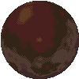
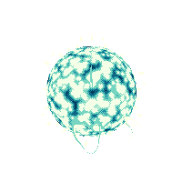
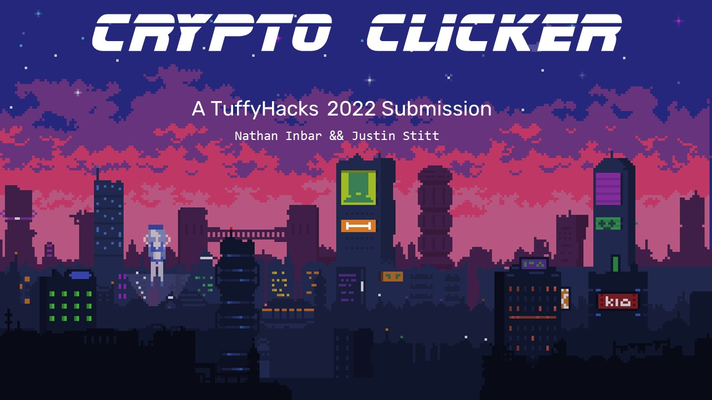
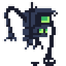
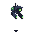
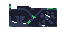

# Crypto Clicker

<a href="www.cryptoclicker.org">www.cryptoclicker.org</a>

  

## YouTube Showcase
[▶ Click to Watch!](https://www.youtube.com/watch?v=6eza_Ij9gHg)

  
## Inspiration
We were inspired by the cyberpunk genre and the popular mobile game "Cookie Clicker".

## What it does
Crypto Clicker is a clicker game where you aim to collect as much bitcoin as you can. Using the bitcoin you get, you can invest in bitcoin mining robots that will accelerate your passive bitcoin income. Alternatively, you can choose to invest in your own mining ability to increase the amount of bitcoin you get per click.
The progression system in Crypto Clicker is measured by destruction to the environment. The more your army of bitcoin miners grow, the more emissions are cast into the atmosphere. High emissions will degrade the earth into a desolate planet over time.

## How we built it
We used svelte to manage the front-end of Crypto Clicker. We used our skill in HTML, CSS, and Javascript to manage components, global variables, conditional styling, and more.

## Challenges we ran into
Both of us have not practciced with Svelte much before so we ran into challenges with component synchronization and managing DOM updates. We also had some challenging CSS to write due to the more complex nature of game graphics in the browser.

## Accomplishments that we're proud of
We are very proud of this project. We utilized standard practice in mockups and git to manage this project which we are proud of too! We had a lot of fun making Crypto Clicker and most importantly learned a lot. 

## What we learned
We learned a lot about the framework and languages we used and the value of planning before coding. We were able to save a lot of time by choosing our tech stack ahead of time and spending a couple hours planning the project out.

## What's next for Crypto Clicker
Crypto Clicker has a lot of potential. We are planning to flesh out the different upgrades and purchasable clickers as well as adding more assets for the planet generation. We would like to incorporate a hostile AI to bring more purpose to the gameplay. 
We would also like to incorporate NFTs into Crypto Clicker and are currently thinking of using an API to retrieve real NFTs that can appear in the game!
